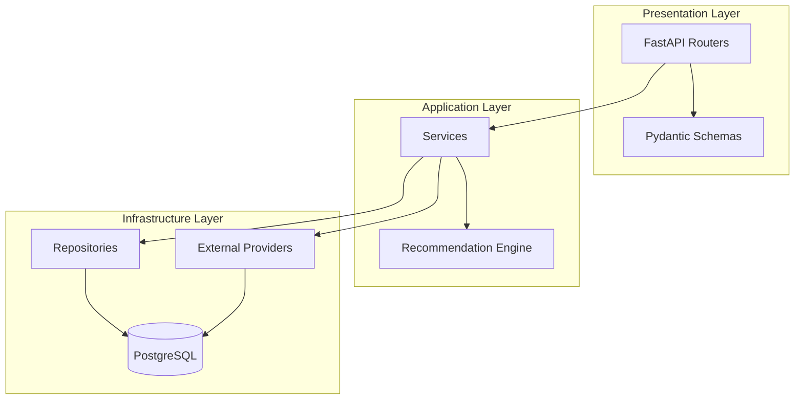
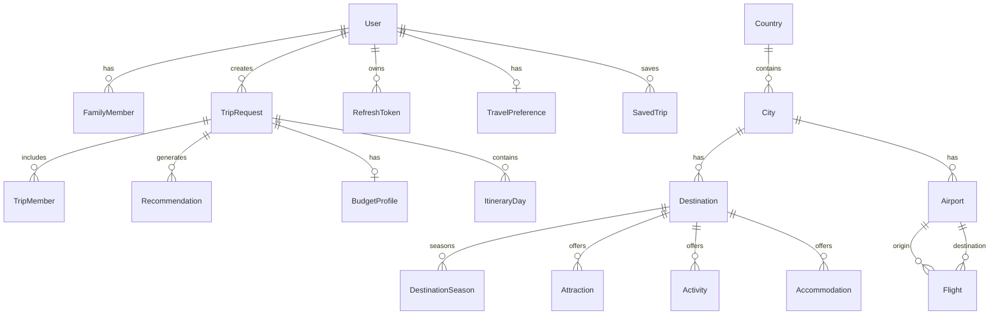
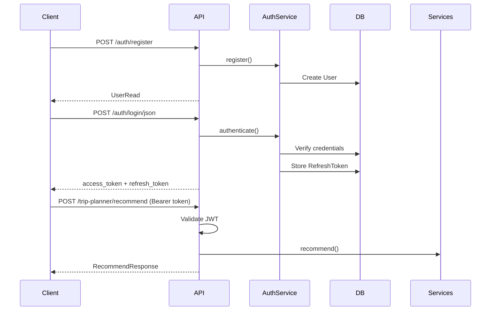
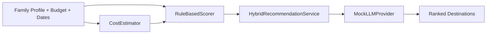

# Architecture

## Overview

Family Trip Planner follows **clean architecture** principles with strict dependency direction: outer layers depend on inner layers, never the reverse.



## Layers

### API Layer (`app/api/`)

- Handles HTTP requests/responses
- Validates input via Pydantic schemas
- Injects dependencies (database session, current user, providers)
- No business logic

### Service Layer (`app/services/`)

- Orchestrates business workflows
- `TripPlannerService` — destination recommendations, cheapest search
- `ItineraryService` — day-by-day plan generation
- `BudgetOptimizationService` — cost comparison and alternatives
- `ChildActivityService` — age-matched attraction filtering
- `CostEstimatorService` — trip cost calculation
- `AuthService` — registration, authentication, token management

### Repository Layer (`app/repositories/`)

- Abstracts database access
- Generic CRUD base with entity-specific query methods
- Uses SQLAlchemy 2.0 async sessions

### Recommendation Engine (`app/recommendation/`)

Hybrid two-part system:

1. **RuleBasedScorer** — weighted scoring using configurable factors:
   - Child age fit (attraction age ranges, theme parks)
   - Budget fit (estimated cost vs budget)
   - Season/weather (DestinationSeason data)
   - Popularity and family-friendliness scores
   - Activity availability and interest matching

2. **RecommendationProvider** (Protocol) — LLM reasoning abstraction
   - `MockLLMProvider` — deterministic template-based explanations
   - Future: OpenAI, Gemini, Claude implementations

3. **HybridRecommendationService** — combines rule score (70%) + LLM score (30%)

### Integration Layer (`app/integrations/`)

Provider pattern for external services:

| Protocol | Mock Implementation | Future Integrations |
|----------|--------------------|--------------------|
| `FlightProvider` | `MockFlightProvider` | Amadeus, Kiwi, Skyscanner |
| `AccommodationProvider` | `MockAccommodationProvider` | Booking.com, Airbnb, Expedia |

Providers are injected via FastAPI dependencies based on `Settings`.

## Entity Relationship Diagram



### Key Entities

| Entity | Purpose |
|--------|---------|
| **User** | Authentication identity with optional Google OAuth |
| **FamilyMember** | Saved family profile (age, interests) |
| **TripRequest** | A planning session with dates, budget, members |
| **Destination** | City-level travel target with scores |
| **DestinationSeason** | Seasonal weather and pricing data |
| **Attraction** | Child-friendly points of interest with age ranges |
| **Recommendation** | Stored recommendation with rule/LLM scores |
| **ItineraryDay** | Generated day-by-day plan items |

## Authentication Flow



- **Access tokens**: JWT, short-lived (30 min default)
- **Refresh tokens**: Stored hashed in DB, rotated on refresh
- **Google OAuth**: Authorization code flow via Authlib

## Recommendation Pipeline



## Swapping Providers

To replace mock providers with real APIs:

1. Implement the Protocol interface (e.g., `FlightProvider`)
2. Register in `app/api/deps.py` based on settings
3. No changes needed in service layer

Example for OpenAI recommendation provider:

```python
class OpenAIRecommendationProvider:
    async def explain_recommendations(self, context, candidates):
        # Call OpenAI API with structured prompt
        ...
```

Set `RECOMMENDATION_PROVIDER=openai` in environment.

## Database

- **PostgreSQL 16** with async SQLAlchemy 2.0
- **Alembic** for migrations
- JSON columns for flexible data (interests, tags, itinerary items)
- Seed script populates 7 European destinations with attractions, accommodations, and flights

## Testing Strategy

- **Unit tests**: Rule engine scoring, mock LLM provider
- **Integration tests**: Auth flow, API endpoints with in-memory SQLite
- **Fixtures**: Async test client with dependency overrides
