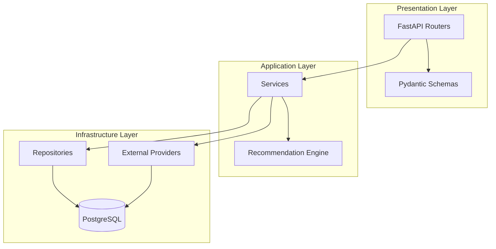
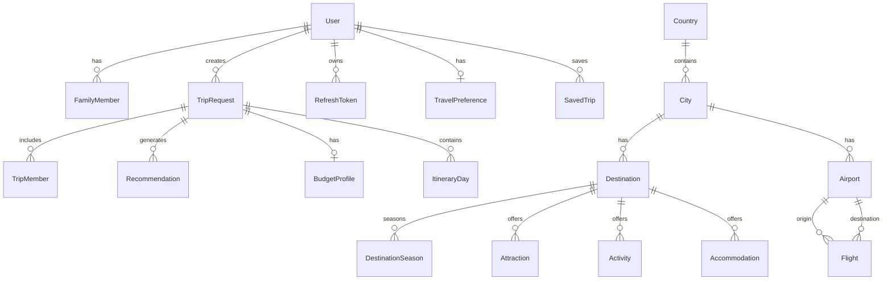
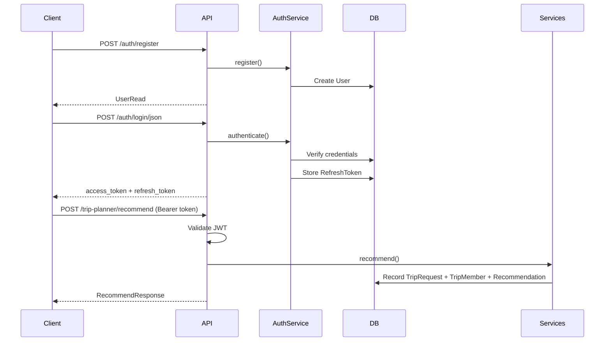

# Architecture

## Overview

Triparoo follows **clean architecture** principles with strict dependency direction: outer layers depend on inner
layers, never the reverse.


```mermaid
flowchart TB
    subgraph presentation [Presentation Layer]
        API[FastAPI Routers]
        Schemas[Pydantic Schemas]
    end

    subgraph application [Application Layer]
        Services[Services]
        RecEngine[Recommendation Engine]
    end

    subgraph infrastructure [Infrastructure Layer]
        Repos[Repositories]
        Providers[External Providers]
        DB[(PostgreSQL)]
    end

    API --> Services
    API --> Schemas
    Services --> RecEngine
    Services --> Repos
    Services --> Providers
    Repos --> DB
    Providers --> DB
```

## Layers

### API Layer (`app/api/`)

- Handles HTTP requests/responses
- Validates input via Pydantic schemas
- Injects dependencies (database session, current user, providers)
- No business logic

### Service Layer (`app/services/`)

- Orchestrates business workflows
- `TripPlannerService` — destination recommendations, cheapest search, records trip history
- `TripHistoryService` — persists and retrieves past trip searches
- `FamilyMemberService` — CRUD for the saved family profile
- `ItineraryService` / `ChildActivityService` — day-by-day plans and age-matched attraction filtering
- `AITripGuideService` — Groq-generated restaurants/hidden gems/local tips, grounded with Google Places data
- `BudgetOptimizationService` — cost comparison and alternatives
- `CostEstimatorService` — trip cost calculation (flights + hotels + activities)
- `AuthService` — registration, authentication, token management

### Repository Layer (`app/repositories/`)

- Abstracts database access
- Generic CRUD base with entity-specific query methods
- Uses SQLAlchemy 2.0 async sessions

### Recommendation Engine (`app/recommendation/`)

Hybrid two-part system:

1. **RuleBasedScorer** — weighted scoring using configurable factors:
   - Child age fit (attraction age ranges, theme parks)
   - Budget fit (estimated cost vs budget)
   - Season/weather (DestinationSeason data)
   - Popularity and family-friendliness scores
   - Activity availability and interest matching

2. **RecommendationProvider** (Protocol) — LLM reasoning abstraction
   - `GroqRecommendationProvider` — real AI call (`llama-3.3-70b-versatile` by default): natural-language
     explanation, highlight phrases, and an independent 0–100 match score per candidate
   - `NullRecommendationProvider` — deterministic fallback used when `GROQ_API_KEY` is unset (never breaks the
     endpoint)
   - Swapping to OpenAI/Gemini/Claude means implementing the same Protocol and updating
     `app/recommendation/factory.py` — no service-layer changes

3. **HybridRecommendationService** — combines rule score and LLM score via `HYBRID_RULE_WEIGHT` /
   `HYBRID_LLM_WEIGHT` (0.7 / 0.3 by default)

### Integration Layer (`app/integrations/`)

Provider pattern for external services — each is a `Protocol` + a factory that swaps implementations based on
`Settings`, with no service-layer changes required:

| Protocol | Implementation | Notes |
|----------|-----------------|-------|
| `FlightProvider` | `AmadeusFlightProvider` | Sole flight provider |
| `AccommodationProvider` | `AmadeusAccommodationProvider` | Sole hotel provider (city-code resolution → hotel list → priced offers) |
| `PlacesProvider` | `GooglePlacesProvider` / `NullPlacesProvider` | Self-serve substitute for the TripAdvisor Content API (partner-only, no public signup). Photo URLs are resolved server-side with `skipHttpRedirect=true` so the API key never reaches the browser |

Both Amadeus providers share a single cached OAuth2 token (`app/integrations/amadeus_auth.py`) instead of
re-authenticating on every request.

## Entity Relationship Diagram


```mermaid
erDiagram
    User ||--o{ FamilyMember : has
    User ||--o{ TripRequest : creates
    User ||--o{ RefreshToken : owns
    User ||--o| TravelPreference : has
    User ||--o{ SavedTrip : saves

    TripRequest ||--o{ TripMember : includes
    TripRequest ||--o{ Recommendation : generates
    TripRequest ||--o| BudgetProfile : has
    TripRequest ||--o{ ItineraryDay : contains

    Country ||--o{ City : contains
    City ||--o{ Destination : has
    City ||--o{ Airport : has
    Destination ||--o{ DestinationSeason : seasons
    Destination ||--o{ Attraction : offers
    Destination ||--o{ Activity : offers
    Destination ||--o{ Accommodation : offers

    Airport ||--o{ Flight : origin
    Airport ||--o{ Flight : destination
```

### Key Entities

| Entity | Purpose |
|--------|---------|
| **User** | Authentication identity with optional Google OAuth |
| **FamilyMember** | Saved family profile (age, gender, interests) — reused by the Trip Planner and Kids Activities so nothing is entered twice |
| **TripRequest** | A recorded search (dates, budget, members, origin) — powers the "My Trips" history page |
| **TripMember** | Snapshot of the family composition at search time, linked to a `TripRequest` |
| **Recommendation** | One row per ranked destination for a `TripRequest`, storing rule/LLM/final scores and the AI explanation |
| **Destination** | City-level travel target with family-friendliness/popularity scores |
| **DestinationSeason** | Seasonal weather and pricing data |
| **Attraction** | Child-friendly points of interest with age ranges |
| **ItineraryDay**, **BudgetProfile**, **SavedTrip**, **TravelPreference** | Modeled and migrated, not yet written to by any service — available for a future "save this itinerary" / "budget preferences" feature |

## Authentication Flow


```mermaid
sequenceDiagram
    participant Client
    participant API
    participant AuthService
    participant DB

    Client->>API: POST /auth/register
    API->>AuthService: register()
    AuthService->>DB: Create User
    API-->>Client: UserRead

    Client->>API: POST /auth/login/json
    API->>AuthService: authenticate()
    AuthService->>DB: Verify credentials
    AuthService->>DB: Store RefreshToken
    API-->>Client: access_token + refresh_token

    Client->>API: POST /trip-planner/recommend (Bearer token)
    API->>API: Validate JWT
    API->>Services: recommend()
    Services->>DB: Record TripRequest + TripMember + Recommendation
    API-->>Client: RecommendResponse
```

- **Access tokens**: JWT, short-lived (30 min default)
- **Refresh tokens**: Stored hashed in DB, rotated on refresh
- **Google OAuth**: Authorization code flow via Authlib
- The Trip Planner requires login, since family data and trip history are persisted per account

## Recommendation Pipeline


```mermaid
flowchart LR
    Input[Saved Family Profile + Budget + Dates]
    RuleEngine[RuleBasedScorer]
    CostEst[CostEstimator via Amadeus]
    LLM[GroqRecommendationProvider]
    Hybrid[HybridRecommendationService]
    History[(TripRequest + Recommendation)]
    Output[Ranked Destinations]

    Input --> CostEst
    Input --> RuleEngine
    CostEst --> RuleEngine
    RuleEngine --> Hybrid
    Hybrid --> LLM
    LLM --> Output
    Output --> History
```

## Swapping Providers

To replace a provider implementation:

1. Implement the Protocol interface (e.g., `RecommendationProvider`)
2. Update the corresponding factory (e.g., `app/recommendation/factory.py`)
3. No changes needed in the service layer

Example for an OpenAI recommendation provider, mirroring `GroqRecommendationProvider`:

```python
class OpenAIRecommendationProvider:
    async def explain_recommendations(self, context, candidates):
        # Call the OpenAI API with the same structured JSON-output prompt
        ...
```

## Database

- **PostgreSQL 16** with async SQLAlchemy 2.0
- **Alembic** for migrations
- JSON columns for flexible data (interests, tags, itinerary items, AI explanations)
- Seed script populates 7 European destinations with attractions, accommodations, and seasons, plus a demo user
  with a starter family (2 adults, 1 child) so the app isn't empty on first login

## Testing Strategy

- **Backend**: pytest — unit tests for rule engine scoring, Amadeus/Groq/Google Places parsing, activity matching,
  origin resolution; integration tests for auth, family CRUD, and trip history against an in-memory SQLite DB with
  dependency-overridden fixtures
- **Frontend**: Vitest + React Testing Library — `AuthContext` session handling, `ProtectedRoute` redirects, the
  Planner's family-sync logic, and a regression test for the Kids tab auto-fill behavior
